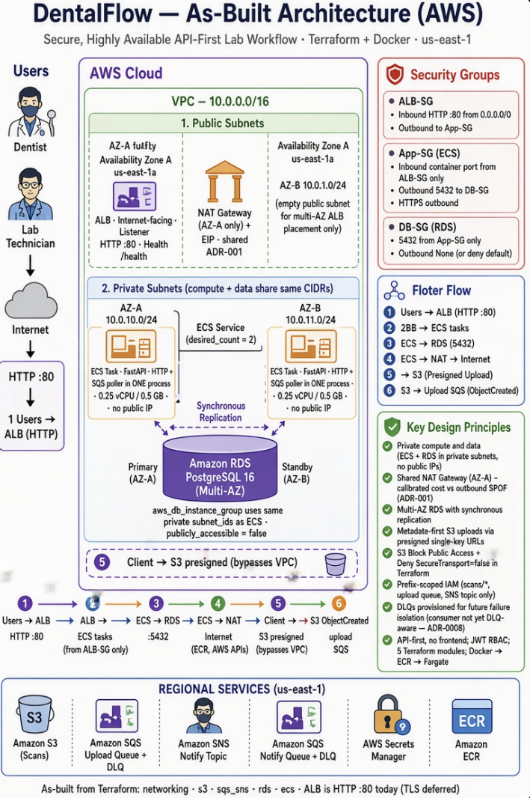
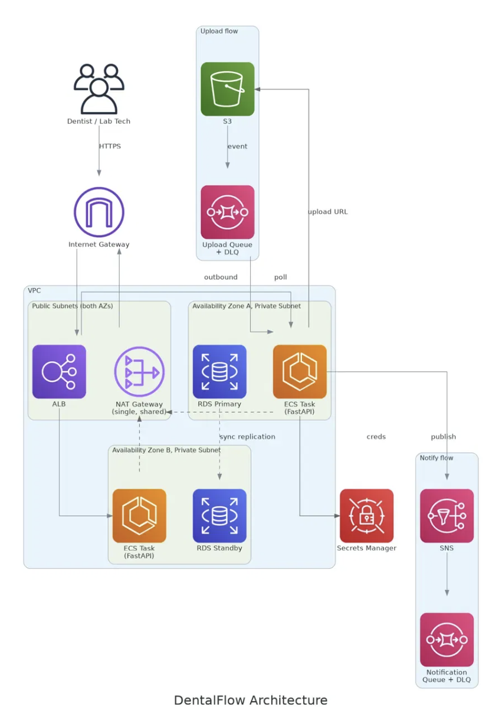
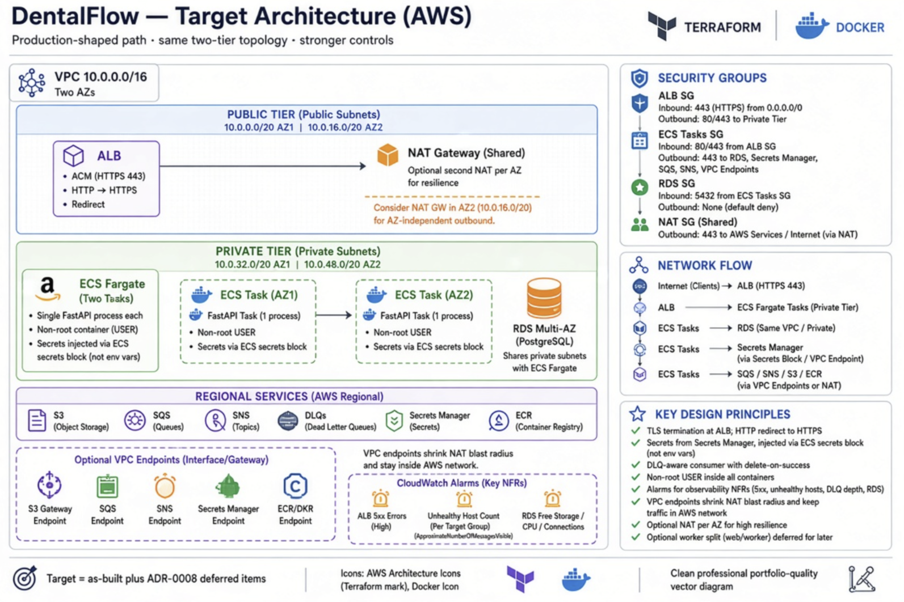

# DentalFlow


A single-tenant dental lab workflow API, built and deployed on real AWS
infrastructure, Terraform-managed, no shortcuts, no local-only demo. Every
flow documented in this repo was run against the live, deployed system, not
simulated.



*As-built, reflects what's genuinely deployed today, verified against real
Terraform output and live AWS evidence, not just designed on paper.*

## Why this exists

Built to gain real, hands-on experience designing and deploying
production-shaped cloud infrastructure, not to pass a tutorial. This
README is written for the people who'd actually review this kind of work,
senior DevOps, Platform, and Cloud Engineers, and recruiters screening for
evidenced skill over a list of tool names.

## What DentalFlow does

DentalFlow models a real digital dental lab workflow. A dental practice
submits a case for a patient, an intraoral scan plus case details, aligners,
crowns, or partial dentures. An internal lab team receives the case,
fabricates the appliance, and the practice is notified once it's ready.
Single-tenant, one practice, one internal lab, by deliberate scope decision
(see [ADR-0000](docs/adrs/0000-single-tenant-scope.md)), modeled on a real
workflow from prior experience at a digital dental manufacturing company.

There is no frontend. The system is demonstrated entirely through its API,
see [ADR-0009](docs/adrs/0009-no-frontend-api-first-demonstration.md) for
why that was a deliberate choice, not an oversight.

## Key engineering decisions

A few of the calls made in this project, and why, each one has a full ADR
behind it:

- **Multi-AZ RDS, but a single shared NAT Gateway.** These look
  inconsistent at a glance, they're not. Losing the database's AZ means a
  full outage, losing the NAT Gateway's AZ only affects outbound-only
  operations while the app keeps serving existing traffic. Redundancy is
  calibrated to actual blast radius, not applied uniformly for its own sake.
  See [ADR-0001](docs/adrs/0001-vpc-network-topology.md) and
  [ADR-0005](docs/adrs/0005-rds-postgresql.md).
- **Two separate SQS queues, not one.** Upload events and lab notifications
  are functionally different, mixing them into one queue with a type field
  would push branching complexity onto every consumer and make failures
  harder to isolate. Each queue gets its own DLQ instead.
  See [ADR-0003](docs/adrs/0003-sqs-sns-notification.md).
- **IAM scoped narrowly, expanded only on real evidence.** The local dev
  credential and the ECS task role both started minimal and were extended
  only when a real integration proved a permission was actually missing,
  never pre-emptively broadened. See
  [ADR-0006](docs/adrs/0006-iam-scoping-for-local-dev-and-ecs-exec.md).
- **No frontend.** Deliberately out of scope, the project's goal is
  infrastructure and operational depth, not full-stack breadth. See
  [ADR-0009](docs/adrs/0009-no-frontend-api-first-demonstration.md).

## Real incidents, found and fixed

None of this was smooth on the first try, and that's the point, this is
what real cloud work actually looks like. A few of the genuine incidents
hit and root-caused during the build:

- ECS task role had zero S3, SQS, or SNS permissions until the first real
  integration test against live AWS surfaced the gap, fixed with scoped
  inline policies, not a blanket permission grant.
- The SQS consumer crashed on its first real message in production,
  `NoReferencedTableError`, because the `User` model was never imported
  anywhere the consumer's process actually loaded, so SQLAlchemy couldn't
  resolve a foreign key it needed at flush time.
- Alembic failed against the real RDS password because `configparser`
  treats `%` as interpolation syntax, and the URL-encoded password
  contained one. Fixed with `%%` escaping, not by changing the password.
- RDS's backup retention setting failed on `terraform apply` with a
  `FreeTierRestrictionError`, discovered by actually running it, not by
  reading documentation first.

The full write-up, root cause, fix, and lesson for each, lives in a
dedicated incidents document (in progress).

## Tech stack

| Layer | Choice |
|---|---|
| Compute | ECS Fargate |
| API | FastAPI, Python 3.12 |
| Database | RDS PostgreSQL, Multi-AZ |
| ORM / migrations | SQLAlchemy (sync), Alembic |
| Storage | S3, presigned URLs |
| Messaging | SQS, SNS, with DLQs |
| Secrets | AWS Secrets Manager (RDS credentials) |
| Auth | JWT, bcrypt |
| IaC | Terraform, 5 modules |
| Container | Docker, ECR |

**Diagram:**



## See it work

The [API walkthrough](docs/architecture/api-walkthrough.md) is the real
proof, every request in it was run against the live, deployed ALB. It
covers the full case lifecycle end to end: registration, login, role-based
access enforced both ways (a lab tech blocked from creating a case, a
dentist blocked from updating fabrication status), the presigned upload and
download round trip, the automatic status transition driven by the SQS
consumer with no manual step, and the real SNS notification pulled directly
off the queue after a case is marked complete.

## Project status

**Done:** all 5 Terraform modules, live-tested. Full FastAPI backend, auth,
RBAC, order lifecycle, S3/SQS/SNS integration. Deployed and running on ECS
Fargate against real RDS. 9 ADRs. Complete, evidence-backed API walkthrough.
Architecture diagram, verified against real Terraform and live AWS output.

**Deliberately deferred, not overlooked**, see
[ADR-0008](docs/adrs/0008-deferred-hardening-items.md):

- Secrets Manager integration for the ECS task definition's `JWT_SECRET`
  and `DATABASE_URL` (currently plain task-definition environment
  variables).
- Non-root container user.
- DLQ-aware retry logic in the SQS consumer (currently deletes every
  message unconditionally after processing, regardless of outcome).

**Not started, on the roadmap:** CI/CD pipeline, CloudWatch observability
and alerting (NFR-OBS-2/3), compiled incidents document.

## Target architecture, the upgrade path

The as-built diagram above reflects what's genuinely deployed today. This
target diagram shows the natural next iteration, TLS termination at the
ALB, VPC endpoints to shrink NAT blast radius, CloudWatch alarms tied to
real NFRs, a DLQ-aware consumer, the items already tracked in ADR-0008 and
the roadmap above, made visible rather than left as a bullet list alone.



## Repo structure

```txt
dentalflow/
├── backend/                 # FastAPI application
│   ├── app/
│   │   ├── main.py            # app entrypoint
│   │   ├── api/routes/          # auth, orders, users
│   │   ├── core/                 # config, security, AWS clients, deps
│   │   ├── db/                    # SQLAlchemy engine, session, models
│   │   ├── schemas/                # Pydantic request/response models
│   │   └── services/                # business logic, S3/SQS/SNS integration
│   ├── alembic/                # DB migrations
│   ├── alembic.ini
│   ├── requirements.txt
│   └── Dockerfile
├── infra/
│   ├── envs/dev/             # root module, wires the 5 modules together
│   └── modules/
│       ├── networking/        # VPC, subnets, NAT
│       ├── s3/                 # scan storage
│       ├── sqs_sns/             # upload + notification queues
│       ├── ecs/                 # Fargate, ALB
│       └── rds/                 # Multi-AZ Postgres
└── docs/
    ├── adrs/                  # ADR-0000 through ADR-0009
    └── architecture/
        ├── dentalflow-architecture1.png    # as-built
        ├── dentalflow-architecture2.png    # target
        ├── requirements.md
        ├── data-model.md
        ├── data-flow.md
        ├── api-walkthrough.md
        ├── pending-applies.md
        └── screenshots/
```

5 Terraform modules: networking, S3, SQS/SNS, ECS, RDS.

## What's next

DentalFlow is the deliberate first step toward **CloudDent**, a future
multi-tenant SaaS version of this same workflow. Building single-tenant
first meant the data model, IAM policies, and network boundaries didn't
have to account for cross-tenant isolation on day one, letting this project
stay focused on genuinely learning Terraform-driven infrastructure, AWS
service integration, and real troubleshooting discipline before taking on
that added complexity. See
[ADR-0000](docs/adrs/0000-single-tenant-scope.md) for the full reasoning.